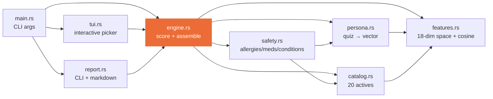
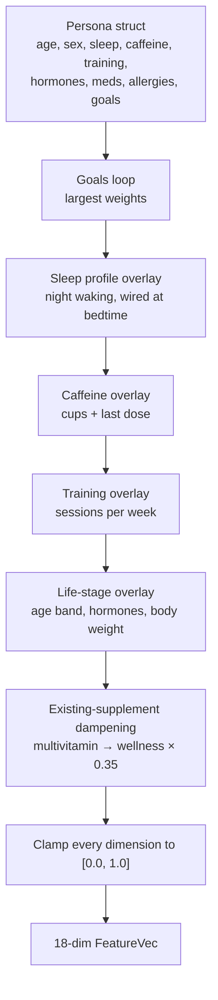
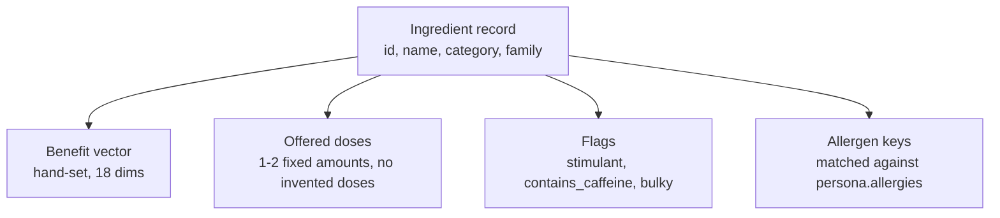
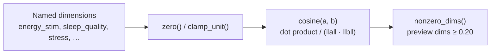
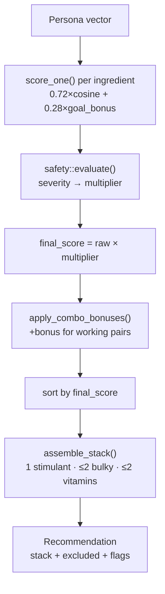
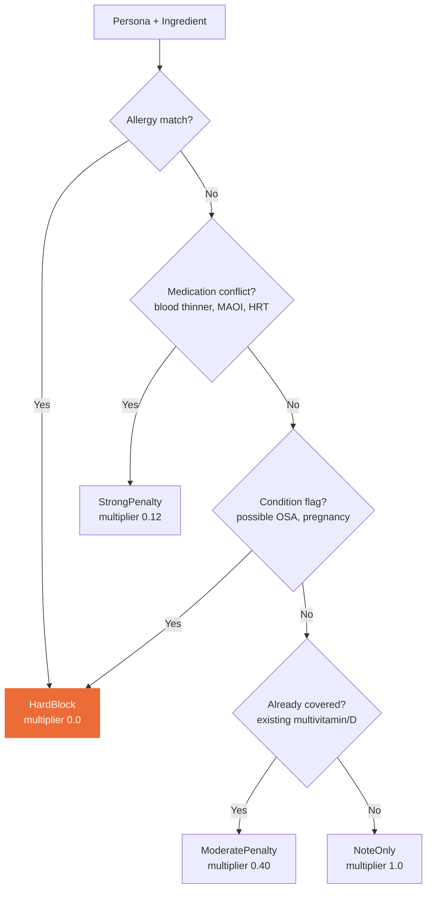
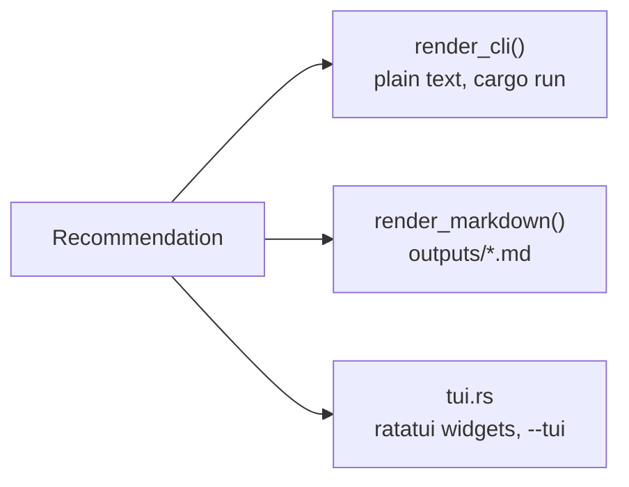

# High-level design

One diagram per layer. Each layer maps to one `src/` file.

## Module map

`engine.rs` is the only module every other layer routes through. Nothing outside it writes a `final_score`.

---

## Persona layer (`src/persona.rs`)

Turns one quiz record into an 18-number need vector. Goals set the largest weights; sleep, caffeine, training, and life stage overlay smaller adjustments on top.

---

## Catalog layer (`src/catalog.rs`)

Fixed at compile time. 20 CLD-9 actives, each with one hand-set benefit vector, one or two offered doses, and a category/family tag used later for stack-diversity caps.

---

## Features layer (`src/features.rs`)

Shared vector math. Both persona and catalog vectors live in this same 18-dimension space, so cosine similarity between them is meaningful.

---

## Engine layer (`src/engine.rs`)

Scores every catalog ingredient against the persona vector, applies the safety multiplier, then greedily assembles a 4-8 item stack.

---

## Safety layer (`src/safety.rs`)

Runs inside `score_one()`, before ranking. A hard block sets the multiplier to `0.0`. No downstream step can raise it back.

---

## Report / TUI layer (`src/report.rs`, `src/tui.rs`)

Two renderers over the same `Recommendation` struct. Neither one recomputes a score. They only format what `engine.rs` already produced.

