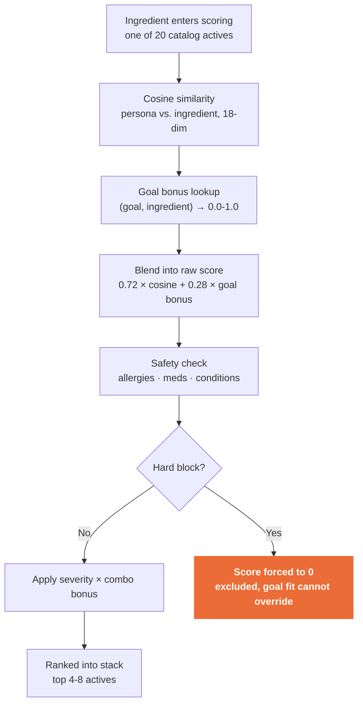

# CLD-9-style daily-sachet recommendation engine

A small, runnable **Rust** engine that mirrors CLD-9's product: a quiz, an algorithm that matches answers to compounds and doses, and one daily drink-mix packet of 4-8 actives instead of a cabinet of bottles.

**Not medical advice.** This is an educational take-home. It does not diagnose, treat, or replace a clinician. Persona B's snoring plus witnessed apneas is a medical-referral flag, not a supplement problem.

---

## Quick start

Needs a Rust toolchain (`rustc` / `cargo`). No other setup, no API keys, no extra crates for the core engine.

```bash
cargo test
cargo run
cargo run -- --persona A
cargo run -- --persona A --allergy ashwagandha
cargo run -- --demo-allergy
cargo run -- --write-outputs
cargo run -- --tui
```

`cargo run` prints ranked stacks for personas A, B, C, K, plus a worked allergy demo. `--tui` opens an interactive picker (ratatui) with a live persona list, an allergy field, and a scrolling result pane.

Sample artifacts are already committed under `outputs/`.

---

## How it works

1. **Vectorize.** Persona quiz answers and each catalog ingredient map onto the same 18-dimension benefit space (`src/features.rs`, `src/persona.rs`, `src/catalog.rs`).
2. **Score.** Cosine similarity between the two vectors, blended with a goal-alignment bonus and a combo bonus for pairs that work together (theanine + coffee, magnesium + a sleep goal).
3. **Filter for safety.** Allergies, medications, and conditions can hard-block or penalize an ingredient. A hard block always wins. Goal fit cannot undo it.
4. **Assemble.** Greedy pick of 4-8 actives, capped at one stimulant, two bulky powders, two vitamins.



Every recommended line prints its goal fit, evidence note, and safety consideration, so a reviewer can trace each score by hand.

### Safety layer (`src/safety.rs`)

Runs before ranking (hard blocks) and during scoring (penalties). A few examples:

| Signal | Action | Example |
|---|---|---|
| Allergy / avoid-list token | Hard block | `ashwagandha` drops KSM-66; `caffeine` drops caffeine and green tea extract |
| Blood thinners | Hard block ginkgo, green tea | antiplatelet / bleeding risk |
| Possible OSA (Persona B) | Hard block stimulants, clinician banner | supplements do not treat apnea |
| Sleep goal + high caffeine | Hard block caffeine, green tea | prefer theanine / magnesium instead |
| Existing multivitamin or vitamin D | Block or down-rank overlapping actives | no silent double-stack |
| HRT (Persona K) | Strong penalty on ashwagandha, boron | do not touch prescribed hormone management |

Full rule table and rationale: `src/safety.rs`.

---

## Personas (always printed)

| ID | Profile | What the engine must not get wrong |
|---|---|---|
| **A** | 45-54F, perimenopause, energy + sleep | Night waking routes to magnesium/theanine; no added caffeine; no invented iron |
| **B** | 45-54M, snores + witnessed apneas | Clinician flag first. No stimulants. No "treat OSA" framing |
| **C** | 25-34M, wired, 4 late coffees | No more caffeine; theanine takes the edge off what he already drinks |
| **K** | 55-64F, post-menopause, on HRT | Creatine for muscle; no extra vitamin D; ashwagandha/boron penalized |

Worked allergy example: `cargo run -- --demo-allergy` removes ashwagandha from Persona A and caffeine (plus green tea) from Persona C, then re-ranks the stack from what's left.

---

## What's simplified vs. production

- No fulfillment, labeling, shipping, or chat UI. This is the matching engine only.
- Explicit vectors and inspectable rules, not a black-box model. That's the point of a take-home: a reviewer can walk the scoring on a whiteboard.
- The catalog is locked to CLD-9's public 20 actives and their offered doses. We don't invent a form or a dose they don't sell: magnesium stays malate, not glycinate, because that's what the builder lists.
- Omega-3 and iron aren't in the public catalog, so the engine says so instead of inventing a line for them.

---

## Project layout

```
src/features.rs   shared 18-dim space + cosine
src/persona.rs    quiz records + vectorize()
src/catalog.rs    locked CLD-9 20-active library
src/safety.rs     allergies / meds / conditions / dedup
src/engine.rs     score, dose, assemble 4-8, explain
src/report.rs     CLI + markdown rendering
src/tui.rs        interactive ratatui picker
src/main.rs       cargo run entry point
data/catalog.md   human-readable catalog lock
outputs/          committed sample runs
```

To extend the quiz: add a field on `Persona`, fold it into `vectorize()` (need signal) and/or `safety::evaluate()` (risk signal). New catalog rows must use a dose CLD-9 actually offers.

---

## Evidence posture

Strength labels are honest: **strong** (caffeine alertness, creatine performance, vitamin D/B12/zinc when deficient), **moderate** (theanine, ashwagandha, magnesium if low, citrulline, taurine), **limited/mixed** (cordyceps, alpha-GPC, ginkgo in healthy adults, boron, DLPA). Sources cited on each line: NIH Office of Dietary Supplements, Cochrane, ISSN position stands, Examine-style trial summaries. Under-claiming beats brochure copy.
